# TinyLLaMA KV Cache Splitting with Kademlia

## 1) Executive Summary

This plan defines a concrete, reproducible experiment to evaluate how to split TinyLLaMA KV cache chunks over a Kademlia-style P2P network, with **latency** as the primary optimization target.

We compare three splitting strategies:

1. **Token + Layer Group** (recommended default candidate)
2. **Token Only**
3. **Layer Only**

and test each under controlled network size, replication, and churn settings.

---

## 2) Objective and Decision Criteria

### Primary objective

- Minimize decode-time retrieval latency (focus on `p95` and `p99`).

### Secondary objectives

- Maintain high retrieval success under churn.
- Control network and storage overhead.

### Final decision rule

Use this weighted score to choose the best policy:

- **60%** latency score (`p95` decode-step latency)
- **25%** availability score (successful retrieval rate under churn)
- **15%** efficiency score (network + storage overhead)

The winner becomes the default split policy for the next P2P-RAGCache milestone.

---

## 3) Inputs and Baselines

Use the existing TinyLLaMA measurements as ground truth for chunk sizing:

- `phase2_outputs/tinyllama_kv_stats.csv`
- `phase2_outputs/tinyllama_kv_layer_stats.csv`
- `phase2_outputs/gpt2_kv_stats.csv` (baseline comparison only)
- `phase2_outputs/gpt2_vs_tinyllama_kv_comparison.csv`

Known measured TinyLLaMA profile from Phase 2:

- Layers: 22
- Attention heads: 32
- KV heads: 4 (GQA)
- KV bytes per token: 45,056 bytes

---

## 4) Strategies Under Test

### S1: Token + Layer Group

- Split by token blocks and small layer groups.
- Parameters:
  - token block: `{32, 64, 128}`
  - layer group size: `{2, 4}`

### S2: Token Only

- Chunk by token blocks; each chunk includes all layers.
- Parameters:
  - token block: `{32, 64, 128}`

### S3: Layer Only

- Chunk by layer blocks over the **active context**; each chunk spans all tokens in that run’s `L`.
- **Strategy-parameter variants** (what the experiment runner encodes in `strategy_variants`):
  - layer block: `{1, 2, 4}` → **3** variants
- **Context length `L`** is **not** part of the S3 variant tuple. It is swept in the **same outer loop** as for S1 and S2 (`L ∈ {128, 512, 1024}` in Stage B / full matrix; fixed at `512` in Stage A). So each S3 variant is evaluated at each `L` like the others—without double-counting `L` inside the “12 variants” total.

---

## 5) Exact Experiment Matrix

## 5.1 Core sweep dimensions

- **Strategy:** `S1, S2, S3`
- **Network size (`N` peers):** `{32, 64, 128}`
- **Replication factor (`R`):** `{1, 2, 3}`
- **Churn scenario:**
  - `C0`: no churn
  - `C1`: 5% peer failures per epoch
  - `C2`: 15% peer failures per epoch
- **Context length (`L`):** `{128, 512, 1024}`
- **Random seeds per config:** `10`

**Alignment with code:** In [`scripts/experiment_tinyllama_kv_kademlia.py`](scripts/experiment_tinyllama_kv_kademlia.py), the cartesian product is **(strategy-parameter variant) × `N` × `R` × churn × `L` × seeds**. That yields **12** distinct split configurations before the network/churn/L/seed sweep.

## 5.2 Per-strategy variant counts

- `S1` variants: `3 token blocks x 2 layer-group sizes = 6`
- `S2` variants: `3 token blocks = 3`
- `S3` variants: `3 layer blocks = 3` (not 9—`L` is a separate sweep axis)

Total **strategy-parameter variants:** `6 + 3 + 3 = 12`

## 5.3 Total run count

Each of the 12 variants is evaluated across:

- `N (3) x R (3) x churn (3) x L (3) x seeds (10) = 810 runs`

Grand total (full matrix):

- `12 variants x 810 = 9,720 runs`

This is a full matrix for publishable rigor.

## 5.4 Staged execution plan (recommended)

Because 9,720 runs is large, execute in 3 stages:

1. **Stage A (screening):**
   - `N={64}`, `R={2}`, churn=`{C0,C1}`, `L={512}`, seeds=`5`
   - Purpose: eliminate clearly poor variants quickly.
2. **Stage B (narrowed sweep):**
   - Top 5 variants from Stage A
   - Expand to full `N,R,churn,L`, seeds=`10`
3. **Stage C (confirmatory):**
   - Top 2 variants
   - Repeat with seeds=`20` for tight confidence intervals.

---

## 6) Runtime Estimate

Runtime depends on simulation step cost. Use this planning model:

- `t_run` = average wall-clock seconds per run
- `parallel_workers` = number of concurrent workers

Then:

- `total_seconds = total_runs x t_run / parallel_workers`

### Example planning numbers

- If `t_run = 0.8s`, `parallel_workers = 8`:
  - `9,720 x 0.8 / 8 = 972s` (~16.2 min)
- If `t_run = 2.0s`, `parallel_workers = 8`:
  - `9,720 x 2 / 8 = 2,430s` (~40.5 min)
- If `t_run = 5.0s`, `parallel_workers = 8`:
  - `9,720 x 5 / 8 = 6,075s` (~1.69 hours)

### Stage A expected runtime (small, quick)

Stage A runs:

- Strategy-parameter variants: `12`
- Sweep points: `N=1, R=1, churn=2, L=1, seeds=5` -> `10` runs/variant
- Total: `120 runs`

At `t_run=2.0s`, `8` workers:

- `120 x 2 / 8 = 30s` (plus setup and I/O)

---

## 7) Metrics to Record

## 7.1 Primary latency metrics

- `decode_step_latency_ms_p50`
- `decode_step_latency_ms_p95`
- `decode_step_latency_ms_p99`
- `chunk_get_latency_ms_p95`

## 7.2 Reliability metrics

- `chunk_success_rate`
- `decode_step_success_rate`
- `timeout_rate`

## 7.3 Routing and overhead

- `avg_hops_per_chunk`
- `bytes_transferred_total`
- `bytes_overhead_ratio = transferred/useful`
- `storage_amplification = replicated_bytes/source_bytes`

## 7.4 Capacity pressure

- `peer_utilization_p50`, `peer_utilization_p95`
- `eviction_events_count`
- `recovery_repair_events_count`

---

## 8) Data Artifacts Per Run

Write outputs under `kv_kademlia_experiments/`:

- `run_config.json`
- `chunk_catalog.csv`
- `placement.csv`
- `access_trace.csv`
- `summary_metrics.csv`
- `figures/`
  - `latency_p95_by_strategy.png`
  - `latency_vs_churn.png`
  - `availability_vs_churn.png`
  - `overhead_vs_replication.png`
- `REPORT.md` (human-readable summary)

---

## 9) Suggested Implementation Work Breakdown

1. **Workload schema + generator**
   - Build deterministic chunk catalogs from TinyLLaMA stats.
2. **Kademlia chunk placement/retrieval harness**
   - Map chunk IDs to DHT keys; support `R=1..3`.
3. **Decode-like trace runner**
   - Multi-chunk GETs per decoding step.
4. **Churn injector**
   - Failure/rejoin events at epoch boundaries.
5. **Metrics and report pipeline**
   - Aggregate CSVs + plots + summary markdown.
6. **Experiment orchestrator**
   - Run full matrix with seeds and parallel workers.

---

## 10) Presentation Narrative (Talk Track)

Use this 6-slide flow:

1. **Problem:** KV cache grows linearly and must be distributed.
2. **Hypothesis:** split policy dominates latency tails in P2P decode.
3. **Methods:** 3 strategy families x network/replication/churn sweep.
4. **Metrics:** p95 latency first; availability and overhead second.
5. **Results:** identify Pareto frontier; choose winner by weighted score.
6. **Decision:** default split policy and next milestone validation plan.

---

## 11) System Flow Diagram

```mermaid
flowchart LR
phase2Data[Phase2TinyLLaMAStats] --> chunkBuilder[ChunkCatalogBuilder]
chunkBuilder --> strategyVariants[StrategyVariantsS1S2S3]
strategyVariants --> placement[KademliaPlacementR123]
placement --> workload[DecodeLikeRequestRunner]
workload --> churn[ChurnInjectorC0C1C2]
churn --> metrics[MetricsAggregator]
metrics --> plots[PlotAndReportGenerator]
plots --> decision[WeightedDecisionEngine]
```

---

## 12) Immediate Next Action

Run **Stage A screening** first, then only promote top candidates into the expensive full sweep. This gives fast signal while preserving scientific rigor.

